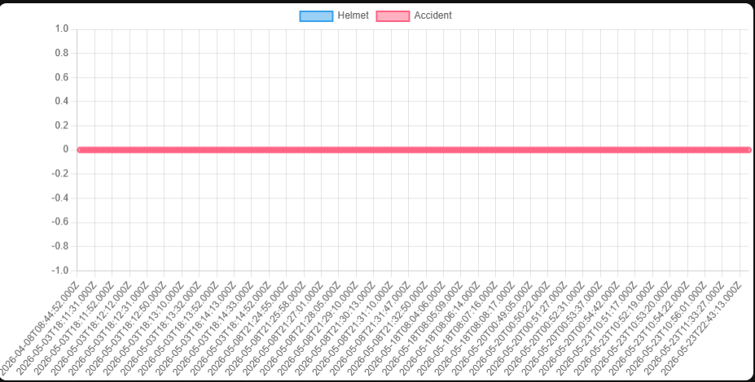
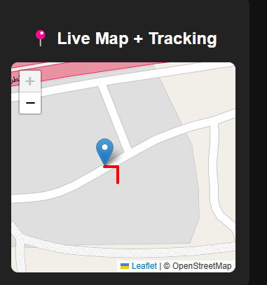
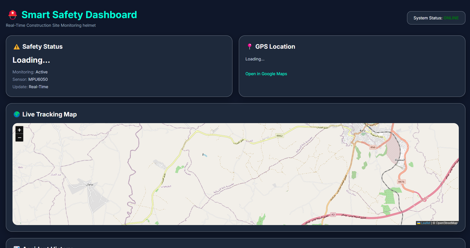
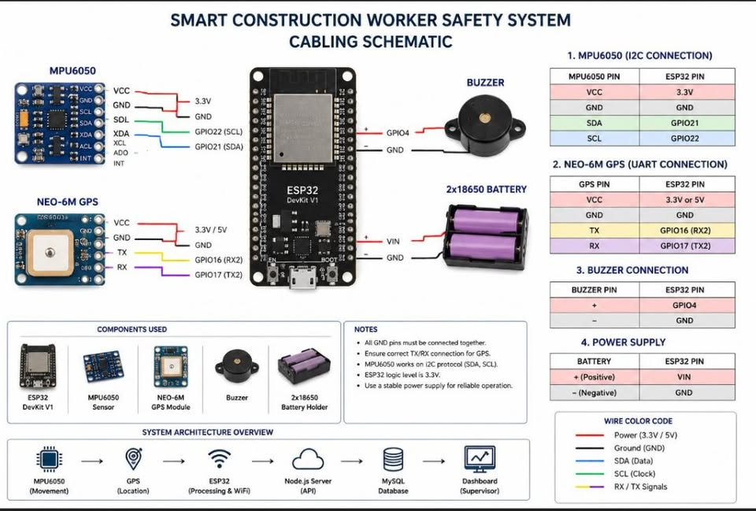
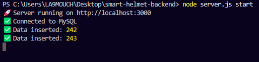
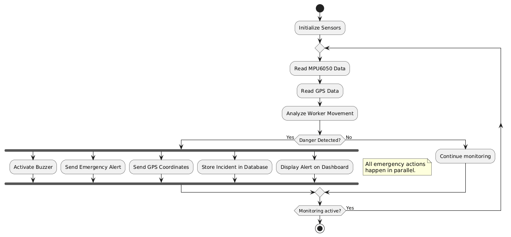

# 🦺 Smart Construction Worker Safety Monitoring System


A smart IoT-based safety monitoring system designed to improve construction
worker safety through real-time accident detection, GPS tracking, helmet
status monitoring, and centralized web-based supervision.

---

## 📖 Overview

Construction sites are among the most hazardous working environments.
This project aims to improve worker safety by combining embedded systems,
sensors, GPS technology, backend services, database storage, and a web
monitoring dashboard.

The system is built around an **ESP32-powered smart helmet** capable of
collecting sensor data and transmitting important events to a centralized
monitoring system.

The monitoring platform allows supervisors to:

- 🚨 Receive accident alerts
- 📍 Track worker GPS location
- 🗺️ View worker position on a map
- 📊 Monitor collected data through charts
- 🪖 Monitor helmet status
- 🔔 Receive audible accident alerts

---

## ✨ Features

### 🚨 Accident Detection

The system uses an **MPU6050 accelerometer and gyroscope** to detect
abnormal movement patterns that may indicate a fall or accident.

When a potential accident is detected:

1. The ESP32 processes the sensor data.
2. An accident event is generated.
3. The buzzer provides an audible alert.
4. The event is transmitted to the backend.
5. The dashboard displays the accident information.



---

### 📍 GPS Tracking

A **NEO-6M GPS module** is used to determine the worker's geographical
position.

GPS information can be transmitted to the monitoring system and displayed
on a map.




---

### 📊 Monitoring Dashboard

The web dashboard provides a centralized interface for monitoring the
worker and visualizing collected information.

It provides:

- Accident monitoring
- Worker status
- GPS information
- Data visualization
- Real-time monitoring information



---

### 🪖 Helmet Status Monitoring

A **Hall-effect sensor** is used to monitor the helmet's status.

The system can determine whether the helmet is properly detected and
use this information as part of the worker safety monitoring process.

---

### 🔔 Audible Alerts

A buzzer connected to the ESP32 provides a local warning when an accident
or critical event is detected.

---

# 🏗️ System Architecture

The overall system is divided into four main components:

```text
┌──────────────────────────────┐
│       Smart Helmet           │
│                              │
│  ESP32                       │
│  ├── MPU6050                 │
│  ├── NEO-6M GPS              │
│  ├── Hall Sensor             │
│  └── Buzzer                  │
└──────────────┬───────────────┘
               │
               │ Sensor / GPS Data
               ▼
┌──────────────────────────────┐
│        Backend Server        │
│           Node.js            │
└──────────────┬───────────────┘
               │
               ▼
┌──────────────────────────────┐
│          MySQL               │
│          Database            │
└──────────────┬───────────────┘
               │
               ▼
┌──────────────────────────────┐
│       Web Dashboard          │
│                              │
│  Charts + Maps + Alerts      │
└──────────────────────────────┘
```

### System Workflow


---

# 🔧 Hardware

The smart helmet integrates several electronic components:

| Component | Purpose |
|---|---|
| **ESP32** | Main microcontroller |
| **MPU6050** | Motion and accident detection |
| **NEO-6M GPS** | Worker location tracking |
| **Hall Sensor** | Helmet status detection |
| **Buzzer** | Local warning and accident alert |

### Hardware Schematic



---

# 💻 Software Stack

## Firmware

- C/C++
- PlatformIO
- ESP32
- MPU6050
- NEO-6M GPS
- Hall sensor

## Backend

- Node.js
- Express.js

## Database

- MySQL

## Dashboard

- HTML
- CSS
- JavaScript
- Charts
- Maps

## Development Tools

- Visual Studio Code
- PlatformIO
- Git
- GitHub

---

# 📡 Communication Workflow

The ESP32 collects information from the sensors and communicates with
the backend server.

```text
Sensors
   │
   ▼
ESP32
   │
   ├── Accident Data
   ├── GPS Data
   └── Helmet Status
   │
   ▼
Backend Server
   │
   ▼
MySQL Database
   │
   ▼
Web Dashboard
```

### Serial Communication Workflow


---

# 📁 Project Structure

```text
Smart-Construction-Worker-Safety-Monitoring-System/
│
├── backend/
│   ├── public/
│   ├── package.json
│   ├── package-lock.json
│   └── server.js
│
├── dashboard/
│   └── Web dashboard files
│
├── database/
│   └── Database scripts
│
├── docs/
│   └── Project documentation
│
├── firmware/
│   └── SmartHelmet/
│       ├── include/
│       ├── lib/
│       ├── src/
│       ├── test/
│       ├── platformio.ini
│       └── .gitignore
│
├── images/
│   ├── accident-detection.png
│   ├── activity-diagram.png
│   ├── dashboard.png
│   ├── gps-google-maps.png
│   ├── live-map.png
│   ├── loopback.png
│   ├── project-schematic.jpg
│   ├── serial-workflow.png
│   ├── server.png
│   ├── system-workflow.png
│   └── use-case-diagram.png
│
├── .gitattributes
├── .gitignore
├── LICENSE
└── README.md
```

---

# 🔄 System Design

## Use Case Diagram


## Activity Diagram


---

# 🖥️ Backend

The backend is responsible for receiving information from the embedded
system and providing communication between the smart helmet, database,
and monitoring dashboard.

The backend is implemented using **Node.js**.

### Backend Responsibilities

- Receive sensor information
- Process incoming data
- Communicate with the database
- Provide data to the dashboard
- Handle accident information
- Handle GPS information



---

# 🗄️ Database

The database stores information generated by the smart helmet and backend
system.

The database can contain information related to:

- Worker status
- Accident events
- GPS coordinates
- Sensor information
- Monitoring data

Database scripts are available in:

```text
database/
```

---

# 🗺️ GPS & Mapping

The monitoring dashboard integrates location information to allow
supervisors to visualize the worker's position.

The system supports map-based visualization of GPS information.


---

# 🧪 Testing

During development, different components of the system were tested
independently and together.

Testing includes:

- ESP32 firmware testing
- Sensor communication
- GPS communication
- Backend communication
- Database connectivity
- Dashboard functionality
- Accident detection
- Map visualization

The project also includes development/testing material such as:



---

# ⚙️ Installation

## 1. Clone the Repository

```bash
git clone https://github.com/donttestitwillwork/smart-construction-worker-safety.git
```

```bash
cd smart-construction-worker-safety
```

---

## 2. Backend Setup

Navigate to the backend:

```bash
cd backend
```

Install the required dependencies:

```bash
npm install
```

Start the backend:

```bash
node server.js
```

---

## 3. Firmware Setup

Open the firmware project using **Visual Studio Code** with the
**PlatformIO extension**.

Navigate to:

```text
firmware/SmartHelmet/
```

Connect the ESP32 to the computer and upload the firmware using PlatformIO.

---

## 4. Database Setup

Navigate to:

```text
database/
```

Import the provided SQL/database scripts into your MySQL server.

Make sure the backend database configuration matches your local
MySQL configuration.

---

## 5. Dashboard

Open the dashboard files from:

```text
dashboard/
```

Start the dashboard according to the project configuration.

---

# 🚀 Usage

Once the system is configured:

```text
1. Power the smart helmet
        ↓
2. ESP32 starts collecting sensor data
        ↓
3. MPU6050 monitors movement
        ↓
4. GPS module provides location
        ↓
5. Hall sensor monitors helmet status
        ↓
6. ESP32 sends information to backend
        ↓
7. Backend communicates with MySQL
        ↓
8. Dashboard displays monitoring information
        ↓
9. Accident → Alert + Buzzer + Dashboard notification
```

---

# 📸 Project Gallery

### Monitoring Dashboard


### Accident Detection


### GPS Tracking


### Live Map


### Hardware


---

# 🎯 Project Objectives

The main objectives of this project are:

- Improve construction worker safety
- Detect potential accidents
- Monitor worker location
- Monitor helmet status
- Provide real-time safety information
- Centralize monitoring through a web dashboard
- Store monitoring data for further analysis
- Combine embedded systems and IoT technologies in a practical
  safety application

---

# 🔮 Future Improvements

Possible future improvements include:

- 📱 Dedicated Android mobile application
- 🔔 Push notifications
- 👥 Multi-worker monitoring
- 🔐 User authentication
- ☁️ Cloud deployment
- 📈 Advanced sensor analytics
- 🤖 Machine-learning-based accident detection
- 🔋 Battery monitoring
- 📊 Advanced historical reports
- 🧑‍💼 Administrator management system

---

# 📜 License

This project is licensed under the **MIT License**.

See the [LICENSE](LICENSE) file for more information.

---

# 👨‍💻 Author

**Oussema Ayari**

IT Graduate specialized in Embedded Systems

- GitHub: [@donttestitwillwork](https://github.com/donttestitwillwork)

---

⭐ If you find this project interesting, consider giving it a star!