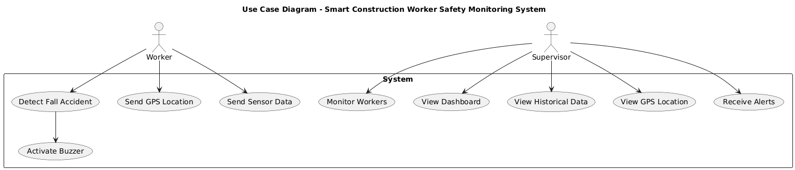

# 📚 Technical Documentation

This directory contains the technical documentation and diagrams for the
Smart Construction Worker Safety Monitoring System.

## 🏗️ System Architecture

The system combines an ESP32-based smart helmet, sensors, a Node.js
backend, MySQL database, and web dashboard.

## 🔧 Hardware Architecture

The smart helmet is built around an ESP32 and integrates the MPU6050,
NEO-6M GPS, Hall sensor, and buzzer.

## 🔄 Activity Diagram

The activity diagram illustrates the main workflow of the system.

## 👤 Use Case Diagram

The use case diagram presents the main interactions between the system
and its users.

## 📡 Serial Communication Workflow

This diagram illustrates the communication workflow between the embedded
system and the backend.

# 📚 Technical Documentation

This directory contains the technical documentation and diagrams for the
Smart Construction Worker Safety Monitoring System.

## 🏗️ System Architecture

The system combines an ESP32-based smart helmet, sensors, a Node.js
backend, MySQL database, and web dashboard.

## 🔧 Hardware Architecture

The smart helmet is built around an ESP32 and integrates the MPU6050,
NEO-6M GPS, Hall sensor, and buzzer.

## 🔄 Activity Diagram

The activity diagram illustrates the main workflow of the system.

## 👤 Use Case Diagram

The use case diagram presents the main interactions between the system
and its users.

## 📡 Serial Communication Workflow

This diagram illustrates the communication workflow between the embedded
system and the backend.

